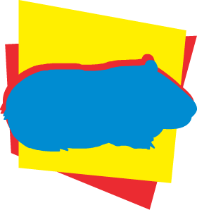

# Nari 🐹
Nari is a stack-based, dynamically-typed scripting language designed to be powerful, simple and portable.
While it's not as intuitive as [other languages I've designed](https://github.com/lartu/ldpl), Nari aims
to suppress problems other languages have, letting you do more by writting less.

In some obtuse way, Nari could be seen as a language opposite to LDPL verbosity.

This repository contains the source code and releases of the nari interpreter.

## License
Nari is distributed under the GNU General Public License 3.0. All Nari logos are released under a Creative Commons Attribution 4.0 International (CC BY 4.0) license.
